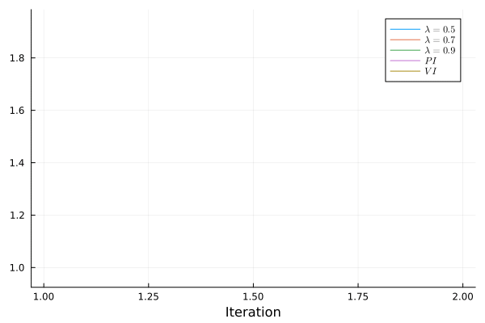

# DataDrivenControl-RL-MultiPlayer

## Introduction
This is my simulation for the Off-Policy Algorithm described in **Model-Free λ-Policy Iteration for Discrete-Time Linear Quadratic Regulation** [paper](https://ieeexplore.ieee.org/document/9511623).

## Experiments:
The optimal feedback gain can be determined as
```math
K^* =    \begin{bmatrix}
 0.0643 & 0.0699 & −0.0667
    \end{bmatrix}
```

Using the Off-Policy PI algorithm, On-Policy VI algorithm, Off-Policy λ-PI, λ =0.5 algorithm, Off-Policy λ-PI, λ =0.7 algorithm, Off-Policy λ-PI, λ =0.9 algorithm.
PI has the fastest convergence rate, VI has the slowest convergence rate, and λ-PI has the intermediate convergence rate.


## Comment
In contrast to the policy iteration (PI) algorithm, the λ-Policy Iteration (λ-PI) does not require an admissible initial
policy and the convergence rate outperforms the value iteration (VI) algorithm.


## Results
### Learning process of PI, VI, and λ-PI algorithm 

|  |  |


## How to use my code

With my code, you can:

* **Off-Policy PI Algorithm** by running `Model_free_PI.jl`
* **On-Policy VI Algorithm** by running `Model_free_VI.jl`
* **Off-Policy PI Algorithm** with λ=0.5 by running `Model_free_lamda1_PI.jl`
* **Off-Policy PI Algorithm** with λ=0.7 by running `Model_free_lamda2_PI.jl`
* **Off-Policy PI Algorithm** with λ=0.9 by running `Model_free_lamda3_PI.jl`

## Docker
I will provide DockerFile soon.

## Requirements

* **Julia v1.10.3**
* **LinearAlgebra**
* **Plots**
* **Kronecker**
* **LaTeXStrings**
